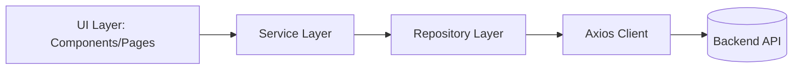

# React App Boilerplate

A scalable, modular, and maintainable **React + TypeScript** boilerplate designed for building production-ready frontend
applications.  
Implements clean separation between `core`, `features`, and `shared` layers — inspired by Clean Architecture and
Domain-Driven Design principles.

---

## Tech Stack

| Category             | Tools / Libraries                                |
| -------------------- | ------------------------------------------------ |
| Framework            | React 19 + Vite 7 + TypeScript 5                 |
| UI & Styling         | TailwindCSS 4, HeadlessUI, Lucide React Icons    |
| State Management     | Zustand (modular per-feature store)              |
| Routing              | React Router DOM v7                              |
| Networking           | Axios (with global interceptors & configuration) |
| i18n                 | i18next + HTTP backend (EN/ID multi-language)    |
| Form Handling        | React Hook Form                                  |
| Data Visualization   | Recharts                                         |
| Dependency Injection | Awilix                                           |
| Linting & Quality    | ESLint, Prettier, Husky, Commitlint              |
| Build Tools          | Vite + TypeScript Compiler                       |
| Testing (optional)   | Vitest / React Testing Library (ready to extend) |

---

## Project Structure

```

src/
├── assets/
│   └── foundation/              # Design assets: colors, icons, fonts, illustrations
│
├── core/                        # Application core (framework-agnostic foundation)
│   ├── api/                     # Axios instances, interceptors, and clients
│   ├── config/
│   │   ├── constants/           # Global constants, enums, static config
│   │   ├── di/                  # Dependency injection setup (Awilix)
│   │   └── env/                 # Environment configuration & schema validation
│   ├── errors/                  # Centralized error definitions
│   ├── exceptions/              # Custom exception classes
│   ├── models/                  # Global models / DTOs
│   ├── router/                  # Application routing definitions and guards
│   └── services/                # Global reusable services (logger, notification, etc.)
│
├── features/                    # Domain-based modular feature system
│   ├── app/
│   │   └── providers/           # Root-level providers
│   │       ├── app_common/      # Global providers (theme, language)
│   │       │   └── effect/      # App-wide startup effects
│   │       └── auth/            # Auth context and providers
│   │
│   ├── auth/                    # Authentication domain
│   │   ├── pages/               # Login, register, reset password, etc.
│   │   ├── repositories/        # Repository layer for API requests
│   │   └── requests/            # DTOs (request/response models)
│   │
│   └── user/                    # User domain (dashboard, profile, etc.)
│       └── pages/               # UI pages for user-facing features
│
├── shared/                      # Shared reusable modules
│   ├── components/              # Reusable UI components and layouts
│   │   ├── atomic/              # Base atoms (Button, Input, Checkbox, etc.)
│   │   ├── common/              # Common UI (modal, notification, loader)
│   │   │   └── notification/
│   │   │       └── toast/       # Toast feedback components
│   │   ├── errors/              # Shared error boundaries
│   │   └── layout/              # Layout templates and wrappers
│   │       └── user_layout/
│   │           └── sidebar/
│   │
│   ├── hooks/                   # Reusable hooks for logic and UI state
│   │   ├── language/            # i18n translation helpers
│   │   ├── router/              # Navigation and routing helpers
│   │   ├── theme/               # Theme (dark/light) management
│   │   └── ui/                  # UI-related logic (modal, scroll lock)
│   │
│   └── types/                   # Global and cross-feature TypeScript types
│
└── public/
└── locales/                 # i18n translation resources
├── en/
└── id/

```

---

## Architecture Overview

| Layer         | Responsibility                                                            |
| ------------- | ------------------------------------------------------------------------- |
| **core/**     | Foundation of the app — routing, configs, global models, and interceptors |
| **features/** | Domain-level modules (auth, user, etc.) — fully encapsulated              |
| **shared/**   | Reusable components, hooks, utilities, and types                          |
| **assets/**   | Visual design assets                                                      |
| **public/**   | Static files & localization resources                                     |

---

## Clean Architecture Flow



---

## Development Setup

### Prerequisites

- Node.js ≥ 18
- Yarn or PNPM package manager

### Installation

```bash
yarn install
```

### Run Development Server

```bash
yarn dev
```

### Build for Production

```bash
yarn build
```

### Preview Production Build

```bash
yarn preview
```

### Lint & Fix Code

```bash
yarn lint
# or
yarn lint:fix
```

---

## Environment Variables

Create a `.env` file in the project root:

```
VITE_API_URL=https://api.example.com
VITE_APP_ENV=development
VITE_DEFAULT_LANG=en
VITE_APP_VERSION=1.0.0
```

All variables prefixed with `VITE_` are automatically exposed to the frontend build.
You can define validation logic in `src/core/config/env/` for type-safe environment configs.

---

## Tools & Standards

| Category                 | Description                                                                          |
| ------------------------ | ------------------------------------------------------------------------------------ |
| **Linting**              | ESLint (with TypeScript, React, and import rules)                                    |
| **Formatting**           | Prettier (auto-run with Husky on commit)                                             |
| **Git Hooks**            | Husky + lint-staged (`eslint --fix`, `prettier --write`)                             |
| **Commit Convention**    | Conventional Commits (`feat:`, `fix:`, `chore:`, etc.)                               |
| **Alias Imports**        | `@/*` → `src/*` (configured via `vite-tsconfig-paths`)                               |
| **State Management**     | Zustand — lightweight, composable state stores                                       |
| **Dependency Injection** | Awilix — clean container-based DI setup                                              |
| **Build System**         | Vite (SWC React plugin for fast HMR)                                                 |
| **Type Checking**        | TypeScript strict mode                                                               |
| **Code Style**           | `kebab-case` for folders, `PascalCase` for components, `camelCase` for hooks & utils |

---

## Folder Philosophy

- **Feature Isolation**
  Each domain (e.g. `auth`, `user`) owns its own `pages`, `repositories`, and `requests`.

- **Shared is Truly Shared**
  Anything reused across features belongs in `shared/`.

- **Core is the Foundation**
  Should contain framework-agnostic setup and base architecture.

- **Consistent Imports**
  Use clean alias-based imports:

  ```
  @/core/...       → core logic
  @/features/...   → domain features
  @/shared/...     → reusable components, hooks, or utils
  ```

- **Avoid Circular Dependencies**
  Never import upward in the hierarchy (`shared → features ❌`, `core → shared ❌`).

---

## Available Scripts

| Command         | Description                                     |
| --------------- | ----------------------------------------------- |
| `yarn dev`      | Run development server with Vite                |
| `yarn build`    | Build production bundle                         |
| `yarn preview`  | Preview production build                        |
| `yarn lint`     | Run ESLint check                                |
| `yarn lint:fix` | Auto-fix linting and formatting issues          |
| `yarn prepare`  | Install Husky hooks                             |
| `yarn test`     | Placeholder (ready for future test integration) |

---

## Contribution Guidelines

1. Fork this repository
2. Create a new branch

   ```bash
   git checkout -b feat/add-new-module
   ```

3. Commit changes using Conventional Commits

   ```bash
   git commit -m "feat(auth): add password reset flow"
   ```

4. Push to your branch and open a Pull Request

---

## Author

**Alfin Noviaji**
Software Engineer
[Personal](https://alpinnz.github.io) • [GitHub](https://github.com/alpinnz) • [LinkedIn](https://linkedin.com/in/alpinnz)

---

## License

MIT License © 2025 — Alpinnz
